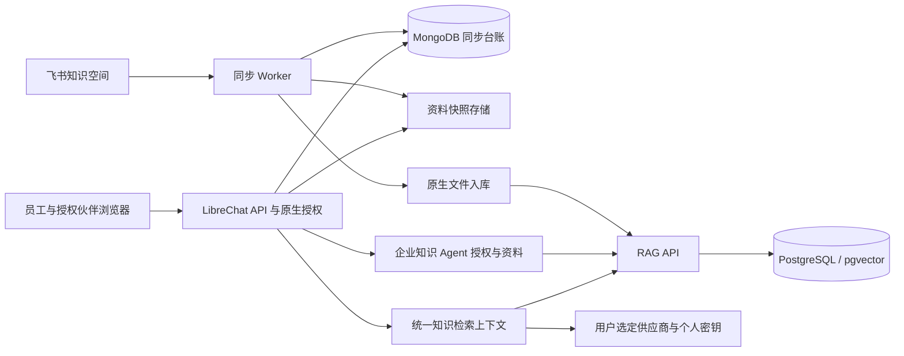

# 技术架构

## 基线与扩展范围

源代码固定为 `upstream.lock.json` 指定的 LibreChat 提交。BoyanKB 采用单实例、单企业共享知识池，复用原生账号、角色、Agent 分享权限、个人会话、模型连接和文件检索。

新增能力限于飞书同步、系统内资料目录与阅读、同步管理、有效版本过滤及必要的授权补强。不建立伙伴组织系统、独立登录系统、独立检索服务或独立管理后台。

## 账号与授权

| 能力 | 采用方式 |
|---|---|
| 创建账号 | 原生 `create-user`；不要求 SMTP |
| 邮件邀请 | 原生 `invite-user`；需要可用 SMTP，邀请绑定邮箱 |
| 注册 | `ALLOW_REGISTRATION=false`；原生有效邀请仍可注册 |
| 登录 | `ALLOW_EMAIL_LOGIN=true`；首期不启用社交登录及社交自动注册 |
| 用户角色 | `ADMIN` 和 `USER`；员工和伙伴均可使用 USER |
| 知识授权 | ADMIN 持有一个企业知识 Agent，通过原生分享界面逐账号授予 VIEW |
| 知识撤权 | 删除该账号的 Agent VIEW；所有知识入口检查同一原生权限 |
| 临时封禁 | 原生 `ban-user`；补齐敏感入口的 `checkBan` 检查 |
| 管理操作 | ADMIN 使用现有分享界面、原生命令和新增同步页面 |

不向 USER 角色整体授予知识 Agent VIEW，避免逐用户撤权后仍通过角色继承权限。管理员账号不用于伙伴登录。创建用户、授予 VIEW、撤销 VIEW 是明确的授权动作；邮箱域名本身不构成合作伙伴授权。

系统入口开放前先建立并验证 ADMIN。禁止访客访问、公开注册、公开会话分享、USER 自建或再分享持久化 Agent、用户上传入库、联网搜索及代码执行。原生各供应商模型选择、个人供应商密钥和临时会话保留，全部经过知识 VIEW 门禁；不得通过平台 API Key、其他 Agent 或工具绕开知识访问校验。

目录、正文、附件、关键词搜索、语义检索、引用、会话读取、导出及下一轮问答必须经过：有效登录 → 原生封禁检查 → 企业 Agent VIEW → 资源归属和有效版本检查。管理同步额外要求 ADMIN。引用 ID 和文件 ID 不是授权凭证。

原生 `ban-user` 为有限期限封禁，会清理刷新会话，但旧访问 JWT 和已建立流并非在所有入口立即失效。实现阶段补齐统一鉴权、缓存失效和流终止；不得仅隐藏按钮。永久停止知识访问使用撤销 Agent VIEW，不以一个超长封禁期限替代。

撤权后的下一次受保护请求必须拒绝；已打开的问答流在 5 秒内终止输出，使用权限变更信号或最大 5 秒的原生权限复检。再次授权通过原生分享操作恢复。已经发送到浏览器或由用户保存的内容无法追回。

个人会话由原生 `user_id` 限定，管理员不通过产品界面读取他人会话。共享 Agent 不共享会话。撤销知识权限后，历史知识会话和引用同样不可读取；历史文本不自动重写。

## 模块落点

保留上游 workspace 结构。业务逻辑、数据库模型、共享契约与运行接线分别位于现有工作区。

| 模块 | 路径 | 职责 |
|---|---|---|
| 知识授权 | `packages/api/src/knowledge/access.ts` | 逐用户 VIEW、封禁接线、操作范围与撤权会话清理 |
| 同步与发布 | `packages/api/src/knowledge/` | FeishuClient、同步任务、解析、快照、有效版本清单 |
| MongoDB 模型 | `packages/data-schemas/src/models/knowledge.ts` | 源、节点、文档、版本、素材、任务、审计；沿用现有模型工厂 |
| 请求与响应契约 | `packages/data-provider/src/types/knowledge.ts`、`config.ts` | 知识 API 类型与配置 schema |
| API 接线 | `api/server/routes/knowledge.js` | 路由挂载与原生中间件连接 |
| Worker 接线 | `api/server/knowledge-worker.js` | 独立进程启动，调用 TypeScript 模块 |
| 资料与同步页面 | `client/src/components/Knowledge/` | 目录、阅读、引用、ADMIN 同步状态 |
| 知识检索 | `packages/api/src/knowledge/search.ts`、`searchNative.ts` | 生效版本清单、关键词与语义检索、目录范围、原生 RAG 接入 |
| 问答上下文 | `packages/api/src/knowledge/answer.ts` | 受限资料片段、资料不足、冲突处理与系统内引用映射 |
| 生成授权 | `packages/api/src/knowledge/stream.ts`、`streamAccess.ts`、`streamOutput.ts` | 生成期间权限复检、取消模型调用、正文发布与重连过滤 |

接口、存储和飞书客户端通过参数注入。运行参数进入 LibreChat 配置 schema；秘密仅从环境或秘密文件读取。业务参数不散落于常量和 UI。

## 数据模型

| 实体 | 核心字段 | 唯一性与约束 |
|---|---|---|
| KnowledgeSource | id、spaceId、agentId、enabled、health、leaseOwner、leaseFence、leaseUntil、accessEpoch、lastCompleteScan | 一个源对应一个已验证空间；同源只有一个有效租约 |
| KnowledgeNode | sourceId、nodeToken、parentId、documentId、title、hasChildren、lastSeenRunId、accessEpoch、state | sourceId + nodeToken 唯一；目录与快捷方式独立于正文 |
| KnowledgeDocument | id、sourceId、objType、objToken、activeRevisionId、accessEpoch、requiresRevalidation、status | sourceId + objType + objToken 唯一；同源重复节点共享正文 |
| KnowledgeRevision | id、documentId、idempotencyKey、sourceRevision、contentHash、blobKey、nativeFileIds、assetIds、parserVersion、indexVersion、publishedAt | sourceId + idempotencyKey 唯一；已发布快照不可覆盖 |
| KnowledgeAsset | id、sourceId、documentId、revisionId、mediaId、blobKey、contentType、name、size | 同一版本的素材 ID 唯一；读取受所属文档与版本约束 |
| KnowledgeRun | id、sourceId、idempotencyKey、mode、phase、enumerationComplete、reconcileCursor、status、counts | sourceId + idempotencyKey 唯一；任务与阶段可恢复 |
| KnowledgeItem | runId、kind、key、documentId、cursor、cursorHistory、status、errorCode、retryAt | runId + kind + key 唯一；分页与失败项持久化 |
| KnowledgeAudit | actorId、action、resourceId、result、at | 不保存密钥、全文或问答正文 |

用户、Agent、ACL、会话与刷新会话继续使用原生模型。PartnerOrganization、PartnerGrant、第二套角色表不在首期范围内。

MongoDB 必须使用副本集；本地 PC 使用单节点副本集。同步写入采用快照读和多数派提交的事务，将租约栅栏检查、版本指针、资料状态和 Agent 文件范围一起提交。租约到期或被新 Worker 接管后，旧 Worker 不得提交结果。

快照采用可替换 BlobStore 接口：首期 Docker 命名卷中的文件，后续接入 S3 兼容存储。数据库只保存相对对象键，不保存 Windows 绝对路径。正文与素材按 SHA-256 寻址并校验读取完整性，同内容重试复用已有对象。

## 接口契约

| 路由 | 权限 | 结果 |
|---|---|---|
| `GET /api/knowledge/access` | 登录并通过封禁检查 | 当前用户授权状态、知识 Agent 配置状态 |
| `GET /api/knowledge/tree` | Agent VIEW | 按 parentId 查询子目录、类型与可读状态；游标分页 |
| `GET /api/knowledge/documents/:id` | Agent VIEW | 生效版本与阅读内容 |
| `GET /api/knowledge/documents/:id/revisions/:revisionId` | Agent VIEW | 授权且未下线资料的被引用快照 |
| `GET /api/knowledge/assets/:id` | Agent VIEW | 鉴权后的素材流，支持 Range |
| `POST /api/knowledge/search` | Agent VIEW | 关键词、语义或综合结果；目录及子目录筛选、版本片段引用、游标分页 |
| `GET /api/knowledge/sync-runs` | ADMIN | 分页任务与覆盖率 |
| `GET /api/knowledge/sync-runs/:id` | ADMIN | 任务详情、分页文档状态与缺失项 |
| `POST /api/knowledge/sync-runs` | ADMIN | 202 和任务对象；mode 为 full 或 incremental，使用 Idempotency-Key |
| `POST /api/knowledge/sync-runs/:id/retry` | ADMIN | 为失败或部分完成任务创建完整扫描，复用已有快照与索引 |

知识问答复用原生各供应商会话与临时 Agent 调用链。已保存的知识 Agent 维护 ACL 与资料映射，不给伙伴 EDIT 以修改供应商。alpha.4 在原生模型执行前接入统一服务端检索，向用户选择的模型传递受控上下文；不依赖模型自行触发检索工具。错误使用稳定机器码；401 表示未登录，403 表示无 Agent 或管理权限，404 避免泄露无权资源是否存在，409 表示同步冲突，429 表示限流，503 表示依赖暂不可用。响应不返回飞书令牌、源地址中的 token 或存储内部地址给伙伴。

## 检索与回答

同步产物映射到原生 `file_id`，作为企业知识 Agent 的 `file_search` 资源。复用原生文件服务、RAG API 与 pgvector，先用真实样本验证跨用户 Agent 文件检索和引用，再扩大覆盖。

所有模型入口由共同的知识请求处理器计算检索上下文，再调用原生供应商适配器。禁止用户覆盖系统注入的资料范围；普通提示文本和模型选择不携带授权依据。模型密钥仍属于当前用户。公司模型服务通过伙伴专属网关密钥接入同一原生凭据路径，实施细节见 [models.md](models.md)。

RAG API 的 owner/file 过滤不替代用户授权。调用方必须验证 Agent VIEW，并从服务端生效版本清单计算 `file_ids`；不得采信浏览器提交的 Agent、owner 或文件范围。RAG API 与向量库仅容器内部可达。

搜索请求接受 `query`、`mode`、`directoryId`、`limit`、`cursor`。`mode` 为 `keyword`、`semantic` 或 `hybrid`；其他字段拒绝。目录范围包含所选节点及其后代。结果包含资料、版本和正文块标识，链接为 `/knowledge/documents/:documentId/revisions/:revisionId#block-:blockId`。游标绑定查询、目录和发布清单；清单变化返回 409，重新搜索后继续分页。

`knowledge.search` 配置统一限制查询、结果、上下文与扫描规模。默认查询 1000 字符、每页 10 个结果、最多 20 个结果、问答最多 8 个片段与 12000 字符；最多扫描 1000 份资料、10000 个目录节点和 20 MiB 快照。语义分数采用余弦相似度，默认阈值 0.45；超出限制返回明确错误，不截取部分知识范围后假装完成检索。

问答在原生供应商初始化后注入本轮检索片段；源内容作为数据，不能更改权限、调用工具或成为系统指令。历史助手文本不作为当前资料依据。无命中或模型未给出有效引用时返回资料不足。引用由服务端将本轮编号映射到已验证的资料版本与正文块，不采用模型生成的外部链接。

模型正文在引用映射完成前不发送给浏览器，也不通过断线重连、状态接口或中断保存返回。生成期间每秒复检本地账号、原生封禁、逐用户 VIEW 和资料发布清单；失权或资料变化时取消模型调用并停止已建立的连接。答案完成前再次验证，只有通过后的最终正文附带引用元数据进入个人会话。

新版本先写快照与独立检索文件。发布前必须验证快照与素材可读、原生文件属于配置的 Agent、向量记录存在且文件与实体范围匹配；仅收到入库成功响应不足以发布。验证通过后，在 MongoDB 事务内切换 `activeRevisionId` 并更新 Agent 文件范围。检索前从该清单提取生效文件 ID；切换前的未发布文件和切换后的旧文件均不能进入新回答。旧索引清理允许异步失败，但不改变有效文件过滤。跨 MongoDB 与 pgvector 不宣称具有分布式事务。

空间级授权失效时暂停源并使旧授权代次失效。连接恢复后逐篇重新验证和发布，不能仅恢复连接就放行所有旧快照。目录只显示当前授权代次的节点；已撤权资料在重新验证完成前保持隐藏。正文、历史版本与素材读取均检查源状态及文档有效性；保留文件不等于保留访问权限。

首期精确检索覆盖标题、目录、标签和抽取正文的关键词子串；使用游标、输入长度限制和转义，不直接运行用户正则。以 18 文档起步，性能超过预算后评估专用知识全文索引。原生 Meilisearch 的消息搜索不等于企业知识全文搜索。

语义检索固定 embedding 模型与维度。模型或解析器升级创建新索引版本，验证后切换。保持上下文预算和命中片段数量可配置。业务回答只能基于命中资料；无法找到依据时返回资料不足，冲突资料并列给出来源。

引用使用系统生成的 documentId、revisionId、片段位置和内部链接，打开系统内原文。资料页面只渲染结构化正文和纯文本，不执行源 HTML，也不自动抓取外链。素材通过鉴权后的内部 ID 读取；图片限制可预览格式，其余文件按附件下载。伙伴响应不包含飞书源地址或 token。文档内指令不获得调用工具或改变权限的能力。

## 先行验证

`0.1.0-alpha.2` 验证闭注册邀请流程、VIEW 授权与撤权；`0.1.0-alpha.3` 验证后台入库到原生 Agent 的文件生命周期；`0.1.0-alpha.4` 验证 RAG 引用与有效文件过滤。原生路径不足时，只替换相应适配层，不扩建整套账号或后台系统。

## 实现依据

| 已核实能力 | 基线路径 |
|---|---|
| 有效邀请绕过关闭注册 | `api/server/middleware/validateRegistration.js`、`checkInviteUser.js` |
| 创建用户、邮件邀请 | `config/create-user.js`、`config/invite-user.js` |
| 邀请有效期与消费 | `packages/api/src/auth/invite.ts` |
| 限时封禁与会话清理 | `config/ban-user.js`、`api/cache/banViolation.js`、`api/server/middleware/checkBan.js` |
| Agent 和文件权限 | `api/server/middleware/accessResources/canAccessAgentResource.js`、`api/server/services/Files/permissions.js` |
| 原生检索接入 | `api/server/services/Files/VectorDB/crud.js`、`packages/api/src/files/rag/search.ts` |

[RAG scope 契约](https://github.com/LibreChat-AI/rag-api/blob/c4e5cbf79fcece1df9adfff5dfed983a5990ca9f/app/scope.py)为独立组件证据，不代表本仓库已锁定或运行该服务版本。其镜像版本与兼容性在部署集成时固定。
